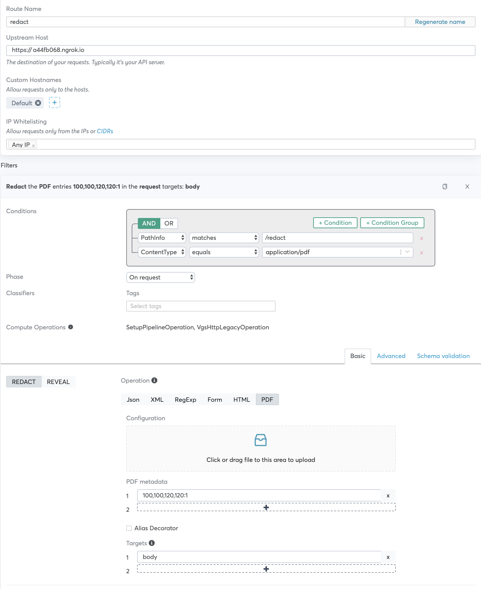

<p align="center"><a href="https://www.verygoodsecurity.com/"></a></p>
<p align="center"><b>Blackout PDf with VGS Proxy</b></p>

# Instructions for using this App
This node app demonstrates a use case using VGS to mask and unmask PDF.


## Requirements
* Node.js
* Ngrok
* Dashboard Access
* Sample PDF


## Run App
```
npm install
```
```
node app.js
```

## Run Ngrok

./ngrok http 3000

## VGS Dashboard Route Config

(You can test with the example yaml files inbound-pdf.yml and outbound-pdf.yml)

- specify the Inbound/Outbound Route -> Destination URL/Upstream Host (e.g. `https://a44fb068.ngrok.io`)
- specify the PathInfo (e.g. `/redact`)
- specify the ContentType equals (e.g. `application/pdf`)
- select Phase `On response` for GET request, `On request` for POST
- choose `Basic > PDF metadata`
- choose an area on the PDF to redact, redaction starts from the bottom left of the file
- configure coordinates like `100,100,120,120:1` the first two numbers are from the left bottom and the last two are the dimensions of the blackout box.

 

## Run Curl 
```bash
curl https://<TENANT_ID>.SANDBOX.verygoodproxy.com/redact \
    -H "Content-type: application/pdf" \
    --data-binary '@sample.pdf'
```
```bash
curl -X GET 'https://a44fb068.ngrok.io/redacted' -k \
    -x $HTTPS_PROXY_USERNAME:$HTTPS_PROXY_PASSWORD@<TENANT_ID>.sandbox.verygoodproxy.com:8080 \
    -H "Content-type: application/pdf" \
    -o sample-revealed.pdf
```


# Host PDF using Python Simple HTTP Server

You can also test reveal/redact while simply hosting PDF via python simple http server and ngrok.

```bash
python3 -m http.server 8000
ngrok http 8000
```

You can also use a script to call the endpoint:
```
import requests

url='https://d9bc7892.ngrok.io/redacted.pdf'
headers = {'Content-type': 'Application/pdf'}
r = requests.get(url,
        headers=headers,
        proxies={"https" : "https://<HTTPS_PROXY_USERNAME>:<HTTPS_PROXY_PASSWORD>@<TENANT_ID>.SANDBOX.verygoodproxy.com:8080"},
        verify=False)


with open('pdf-sample-revealed.pdf', 'wb') as f:
    f.write(r.content)
```

 


